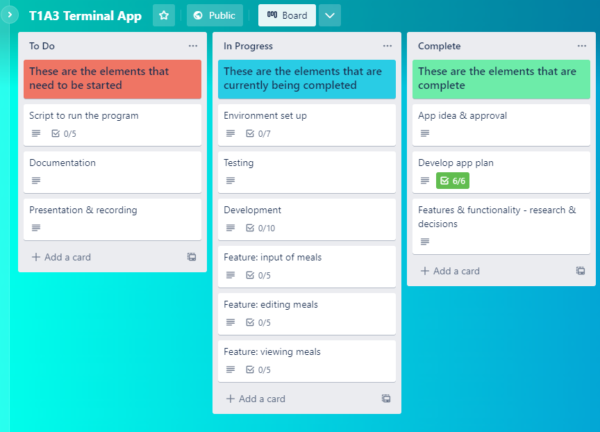

# T1 A3 Food Diary Terminal App
The purpose of this terminal app is to allow users to track their daily meals.

The Food Diary app is targeted for users who want to form a daily habit around tracking their meals, and ensuring they stay on track with specific nutrition goals.

Users can input today's and yesterday's meals in the app and view their food diary in table format on the terminal screen. Users also have the opportunity to edit today's meals in case they have made a mistake or omitted information.

*Note:* the app is designed to form a daily habit around tracking meals. Therefore, only today and yesterday's meals can be inputted. Users are unlikely to remember what they ate a week ago, let alone several days ago so it is unnecessary to include a function for entering and editing historic data past yesterday.

**PEP8** styling conventions were used to ensure readability and consistency in code. This includes:
* Indentation of 4 spaces per indentation level.
* Imports on separate lines.
* Avoiding extraneous whitespace in expressions and statements.
* Using full sentence comments that are clear and easily understandable.
* Function and variable names in lowercase, with words separated by underscores.

**GitHub Project Link**  
View the Github repo here: https://github.com/KarlaB3/T1-A3-Terminal-App

**Presentation Video**  
View the presentation video here: 

**Project Management Board**  
View the Trello project management board here: https://trello.com/b/TwGduS2x/t1a3-terminal-app

**Testing Process**  
View the manual test case procedures and results here: https://docs.google.com/spreadsheets/d/1VfLTricsIO6EEbugapw_jGdTI7tB39GkXV33-ZSg-Mg/edit?usp=sharing 

**Tech Stack:**
* Python source code, using the PEP8 styling convention written in Visual Studio Code.
* Python libraries: 
    * Pandas for creating dataframes and reading and writing to the .csv diary file. 
    * Datetime for calling today's and yesterday's date.
    * Prettytable for listing additional user options and to display the diary in table format in the terminal window.
    * Termcolor for coloured text to highlight important messages (green - confirmations, blue - instructions, red - errors).
* Markdown ReadMe file written in Visual Studio Code.
* GitHub for managing source code changes and tracking and controlling versions of the source code.
* Bash .sh file to execute the program.

# About The Project

## App Features
Three main features that make up the Food Diary terminal app are below.

**Input of Meals**  
This feature uses an intitial datetime function (today and yesterday) to check if users have inputted meals today and yesterday.

If there is no input for today and yesterday, the today and yesterday input functions prompt users to enter their meals - breakfast, lunch, dinner, snack. Input is saved as a dictionary to be called upon later, and displayed for the user to view immediately.

While loops are used to ensure users cannot enter an empty value - they must enter something for each meal for the program continue. For example, users must initially enter a value for breakfast before moving to lunch, then dinner. 

Confirmations are displayed to the user when they have successfully inputted their meals.

Feature implementation plan in Trello:  

**Reading and Writing to CSV**  
This feature utilises Pandas to convert the meal dictionary into a DataFrame which is then saved as a .csv file. 

When a user first runs the app, the add input function checks if a .csv file already exists. This ensures that meal data is not duplicated across multiple files, so the diary is stored in one place for easy viewing and editing. 

If a diary .csv file does not exist yet, it is created and referenced later for reading and writing when inputting and editing meals. If a diary .csv file already exists, the program references this file for reading and writing when inputting and editing meals.

Feature implementation plan in Trello:  

**Editing Meals**  
This feature utilises a today datetime function and Pandas to locate the row containing today's meals and then overwrite existing meal data in that row with what users have inputted.

Users are given the option to edit a specific meal type - breakfast, lunch, dinner or snack. They must enter the correctly formatted value, otherwise they receive an error message that the input isn't recognised, and to try again. They are then prompted to enter the meal type of choice to edit.

Once meals are edited, users are prompted to view additional diary features including viewing the diary or exiting the program.

Feature implementation plan in Trello:  

## Implementation Plan
The project plan was tracked using Trello. View the board here: https://trello.com/b/TwGduS2x/t1a3-terminal-app 

The project was broken down into 5 stages:

**1. Initial Planning**  
In the initial planning stage a full outline of the tasks and sub-tasks required to complete the project were listed in Trello in order of what was to be actioned and completed first. This ensured no steps were missed and provided a useful guideline for the order of operations.

**2. Planning Progress**  
The first step, which was the initial approval of the app idea by Coder Academy educators, was critical to moving onto the rest of the project. Upon approval, a full app plan was developed including target users and app features. Then decisions on key app features and functionality were made, and the research of Python packages and useful functions commenced.

**3. Testing & Development**  
The testing and development stage took the majority of project time. Manual tests were conducted on two key features (to be discussed later in this document) and then developed in Visual Studio Code. Key feature plans were also created as these features are critical to the app running as expected, without errors. 

**4. Scripting & Documentation**  
In this stage a bash script was written to facilitate execution of the program. In addition, documentation (README.md) was written containing all information necessary for users to run the program plus additional helpful information about the program and its functions and features.

 

**5. Completion & Submission**  
The fifth and final stage was to package up all files and documentation into a .zip file as per the assessment requirements, and submit via Canvas.

 

## Testing
Manual testing was used to test two functions critical to ensuring the program runs as expected, and to improve the overall user experience. The Google Sheets testing documentation can be found here: https://docs.google.com/spreadsheets/d/1VfLTricsIO6EEbugapw_jGdTI7tB39GkXV33-ZSg-Mg/edit?usp=sharing and can also be accessed here: [link to file in docs]

**Test Case:**   
What was your process?
what were the results?

**Test Case:**   
What was your process?
what were the results?

# Help Documentation
Dependencies:
* Bash command line interface shell program.
* Python 3.

Follow these instructions to successfully install and run the app:
1. Download and unzip the .zip file titled 'KarlaBucoy-T1A3.zip'.
2. Open your Bash command line interface (CLI) shell terminal.
3. In the Bash CLI, navigate to the 'src' folder.
4. Run the 'run_app.sh' script using the command 'bash run_app.sh'.

The script will do the following:
* Check if you have the correct version of Python installed. If not, an error message will be displayed providing a link to download and install Python 3.
* Create a virtual environment.
* Activate a virtual environment.
* Install Python packages via the 'requirements.txt' file.
* Run the 'run_app.sh' script.